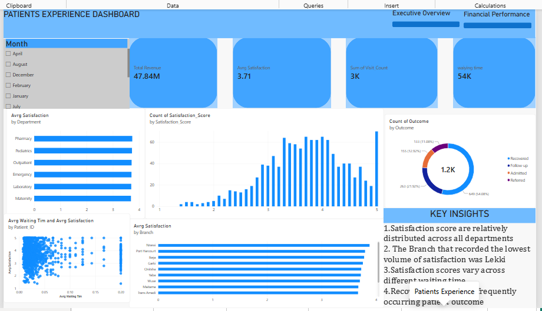

Healthcare Performance & Patient Analytics Dashboard

A Power BI project analyzing healthcare performance, patient activity, hospital operations, financial performance, and patient experience across different states in Nigeria.

Project Progress

Page 1 — Executive Overview: Completed

Currently progressing through the remaining pages and analysis requirements.
### Dashboard Preview

## Task 2 — Patient Analysis

In this phase of the project, I analyzed patient demographics,
diagnoses, patient volume, and patient outcomes.

### Analysis Areas

- Patients by Age Group
- Male vs Female Patients
- Patients by Diagnosis
- Patients by State
- New vs Returning Patients
- Average Visits per Patient
- Patient Outcomes

### Key Insights

1. Age 30–44 represents the largest patient group.
2. The analysis identified the most common diagnoses among patients.
3. Patient volume varies across the different states.
4. Returning patients accounted for a significant portion of patient visits.
5. Recovered was the most common patient outcome.

### Tools Used

- Power BI
- DAX
- Excel

### Dashboard Preview

## 📅 Day 3 — Hospital Operations

Today, I completed **Page 3 — Hospital Operations** of my Healthcare Performance & Patient Analytics Dashboard using Power BI.

### 📊 What I Analyzed
- Visits by Department
- Average Waiting Time
- Waiting Time by Department
- Patient Satisfaction by Department
- Patient Outcomes
- Branch Performance
- Monthly Patient Volume

### 🔍 Key Insights
- Patient volume varies across departments and branches.
- Waiting times differ across departments.
- Patient satisfaction varies across departments.
- Recovered patients were the most frequently occurring outcome.
- There is no clear relationship between waiting time and patient satisfaction.

### 🛠️ Tools Used
- Power BI
- DAX
- Interactive Visualizations
- Slicers

### 📸 Dashboard

## Day 4 — Financial Performance

Today, I worked on the Financial Performance section of my Healthcare Performance & Patient Analytics Dashboard using Power BI.

### What I Analyzed
- Total Revenue
- Total Cost
- Total Profit
- Profit Margin
- Revenue by State
- Revenue by Department
- Revenue by Service
- Monthly Revenue
- Revenue vs Target
- Revenue Variance and Achievement

### Key Insights
- River(s) recorded the highest revenue among the states.
- Paediatric recorded the highest departmental profit.
- Paediatric Care generated the highest service revenue.
- Maternity Care recorded the lowest profit.
- Several states were below their revenue targets.
- Some services generated high revenue but relatively low profit.

### Power BI Skills Applied
- DAX Measures
- KPI Cards
- Bar/Column Charts
- Line Charts
- Target and Variance Analysis
- Slicers and Report Interactivity

### Dashboard Screenshot

# Day 5 – Patient Experience

## 📊 Healthcare Performance & Patient Analytics Dashboard

Today, I focused on building the **Patient Experience** page of my Power BI healthcare analytics dashboard.

### 🎯 Focus Areas
- Average Satisfaction Score
- Satisfaction by Department
- Satisfaction by Branch
- Satisfaction vs Waiting Time
- Patient Outcomes
- Satisfaction Distribution

### 🔍 Key Insights
- Satisfaction scores were compared across departments and branches to identify differences in patient experience.
- The relationship between waiting time and patient satisfaction was analyzed.
- Patient outcomes were reviewed to understand the overall experience and results of patient visits.
- The analysis helps identify areas where patient experience may require further attention.

### 🛠️ Power BI Skills Applied
- Data visualization
- DAX measures
- Slicers and filtering
- Interactive charts
- Scatter charts
- Bar charts
- Conditional formatting
- Dashboard design

### 📸 Dashboard Preview

### 🚀 Project Progress
This is **Day 5** of my Healthcare Performance & Patient Analytics Dashboard project, continuing my journey in Power BI and data analytics.
