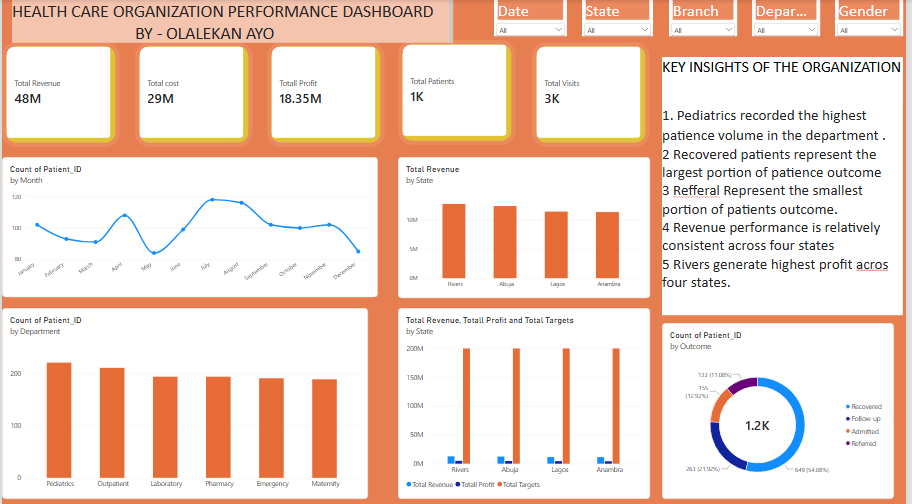
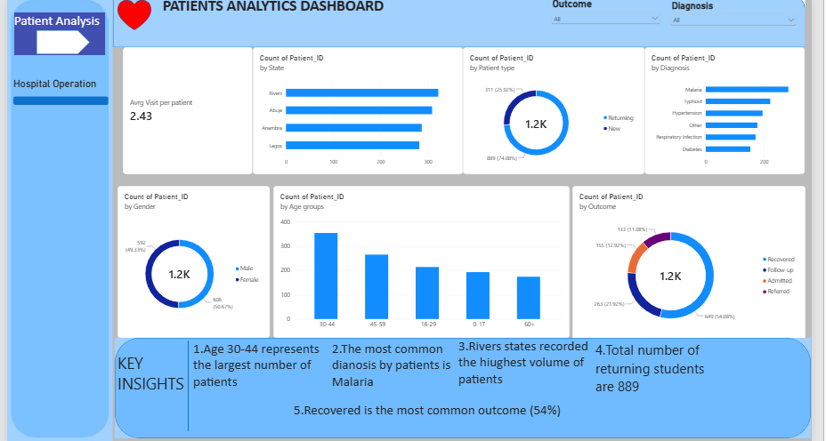
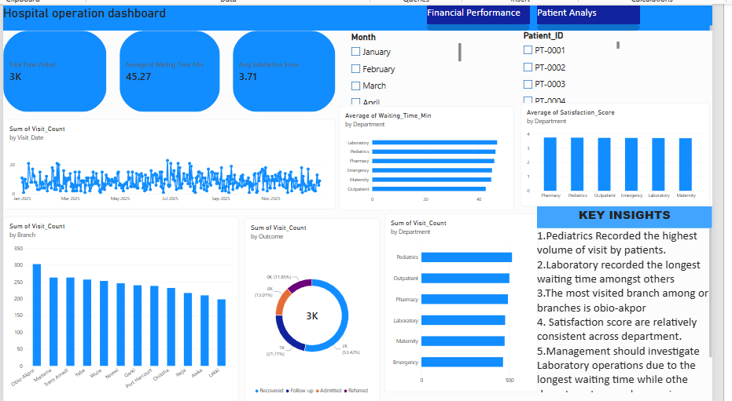

Healthcare Performance & Patient Analytics Dashboard

A Power BI project analyzing healthcare performance, patient activity, hospital operations, financial performance, and patient experience across different states in Nigeria.

Project Progress

Page 1 — Executive Overview: Completed

Currently progressing through the remaining pages and analysis requirements.
### Dashboard Preview

## Task 2 — Patient Analysis

In this phase of the project, I analyzed patient demographics,
diagnoses, patient volume, and patient outcomes.

### Analysis Areas

- Patients by Age Group
- Male vs Female Patients
- Patients by Diagnosis
- Patients by State
- New vs Returning Patients
- Average Visits per Patient
- Patient Outcomes

### Key Insights

1. Age 30–44 represents the largest patient group.
2. The analysis identified the most common diagnoses among patients.
3. Patient volume varies across the different states.
4. Returning patients accounted for a significant portion of patient visits.
5. Recovered was the most common patient outcome.

### Tools Used

- Power BI
- DAX
- Excel

### Dashboard Preview

## 📅 Day 3 — Hospital Operations

Today, I completed **Page 3 — Hospital Operations** of my Healthcare Performance & Patient Analytics Dashboard using Power BI.

### 📊 What I Analyzed
- Visits by Department
- Average Waiting Time
- Waiting Time by Department
- Patient Satisfaction by Department
- Patient Outcomes
- Branch Performance
- Monthly Patient Volume

### 🔍 Key Insights
- Patient volume varies across departments and branches.
- Waiting times differ across departments.
- Patient satisfaction varies across departments.
- Recovered patients were the most frequently occurring outcome.
- There is no clear relationship between waiting time and patient satisfaction.

### 🛠️ Tools Used
- Power BI
- DAX
- Interactive Visualizations
- Slicers

### 📸 Dashboard

